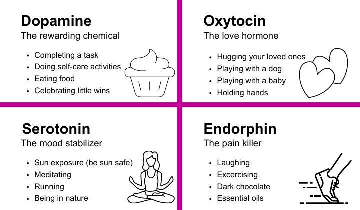

Missions provide short-term, meaningful challenges that can be achieved in a few sessions. Completing a task releases a feel-good chemical (i.e., Dopamine) in the user's brain, which encourages users to repeat the same action. Consequently, this leads to an increase in the overall Lifetime Value (LTV).

### Objective
To increase the LTV by 

- Making users play more than their habit i.e. longer sessions, higher retention and monetisation 
- Making users bet more than their habit i.e. higher bet, higher monetisation

### Criteria to create a Mission?
1. Missions should **fit within the core loop action**. For Octro Poker, the core loop involves playing Poker: Public, SNW, SNG, and MTT.
2. Missions **shouldn't distract a user from their normal behaviour**; however, they can be exploratory at times. If a user loves to play MTTs, the mission should be related to that preference unless we believe they might enjoy other game modes.
3. Missions **shouldn't primarily involve the actions of others**. For example, quests like 'invite x users to the game' require actions from other users.
4. **The rewards of missions should be scaled according to their difficulty.**
5. Every mission **should differ in some way.**
6. Missions **shouldn't be boring** (i.e., repetitive and lacking novelty) or **menial** (i.e., simplistic and unrewarding). They should be quick and fun to complete.

### Type of Missions
1. Bounty: It should be completed without any extra effort, just through normal behaviour.
2. Habit Forming: For new or reactivated users, we can encourage them to play x hands at any table to win y rewards.
3. Challenge: Higher difficulty with greater rewards.

Weekly missions should nudge users to come a maximum number of days in a week. If a user comes x days in a week, we should push for x+1 days. (assuming x is less than 7). 

### User Segmentation
- Level 1: Gametype (i.e., Public, Spin n Win, Sit n Go, MTT)
- Level 2: Stakes (i.e., table level)

Example: if a user plays public 50 hands each day at stake 50k/100k, he should be given the following missions

- Play 55 hands at 50k/100k (objective 1: play more)
- Win 6M at 50k/100k (objective 1,2: play more, bet more) [6M = 20% of extra of chips losing (50*100k)] etc.

### Resources
- [Daily Quest systems you thought were innovative/well-executed](https://www.reddit.com/r/gamedesign/comments/f79ecg/
daily_quest_systems_you_thought_were/)
- [How do I make daily quests not feel boring or menial?](https://www.reddit.com/r/gamedesign/comments/z0irdp/
how_do_i_make_daily_quests_not_feel_boring_or/)

- [Designing daily quests for multiplayer games](https://zeworkshop.wordpress.com/2017/06/17/designing-daily-quests-for-multiplayer/)

Examples from competitors 

