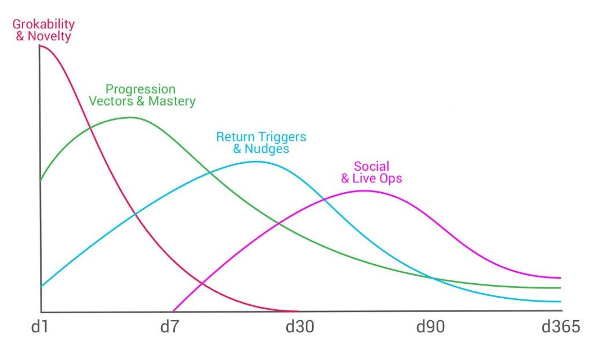

# Retention

Retention is the percentage of users who come back to the game again after installation after a given time period. For example, if D1 is 30%, 30% of the users come back again on the next day of installation. I believe retention is a primary KPI in LTV as we can figure out how to make money from retaining users. If there is no retained user, there is no money.

## How to increase Retention? 

Increasing it depends following three things

1. Users should like the game 
2. Users should think of coming back again to the game
3. Users should return to the game 

### Users should like the game

First, users should get to the game as quickly as possible. On first download, download only minimal files to let the user experience the game. As they grow older, we can start downloading other files in the background or on demand. As per Google Play “For every 6 MB increase to an APK’s size, we see a decrease in the install conversion rate of 1%”.

Next, users should experience the positive emotion on the first gameplay session. As per Google Play, users who spend 10 minutes or more have higher retention. For example, get an ace pair in Poker, complete a level in candy crush, matchmake with a lower rated opponent in chess, win a battle in Clash Royale, appreciation from group members in PUBG etc. We can also give a short term mission for new users to increase session length. 

For day 0, we should track onboarding and engagement metrics like onboarding completion %, users who spent at least 10 minutes % etc. 

### Users should think of coming back again to the game

Once a user completes his onboarding and first gamesession, we should focus on bringing back to the game. In one of the Linkedin articles, someone has mentioned that users come back to the game due to one of the reasons: Unfinished tasks, Friends or Community, Sense of progression, Fear of missing something and Expectation that the game will offer something new. I have seen these are implemented across various games

1. Unfinished tasks: In Clash Royale, it offers a chest reward which can open only after 90 minutes. So if I quit the game, I would likely open the game to claim the reward.
2. Friends or Community: In Coin Master, it sends a notification to attack back when someone attacks your village. I tend to play games to get revenge. 
3. Sense of progression: If i achieve something important in the game like a power booster, extra life etc, i would more likely to get back to the game. 
4. Fear of missing something: If there is a 3 day knockout event and I have successfully completed Day 1, I would be more likely to come on Day 2. 
5. Expectation that the game will offer something new: Coin Master has too many events running at a time. Sometimes, I want to login and see the events. And, if my favorite event is running, I do participate.

### Users should return to the game 

When the user returns back to the game, they should feel great. In single player games, we can give bonuses (daily login bonuses, streak rewards, or loyalty programs) to play a few rounds of games. In multiplayer, along with bonuses, we can also nudge users to play with or against their friends which can make them feel good. For Day 1 to x, we can track Dx which is the percentage of users who come on x th day after install. 