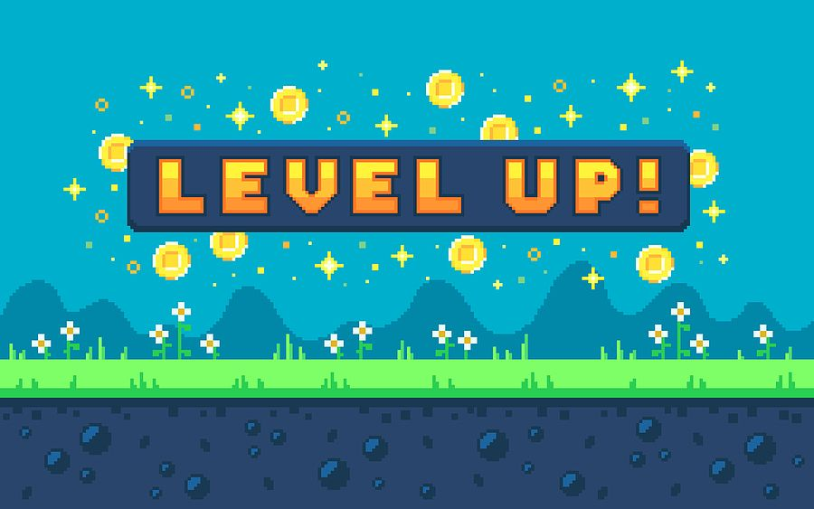

# XP Level

XP (Experience Points) represent the overall experience of a user in the game. Experience points and levels often have a direct relationship. Typically, each level will have an associated XP target. Once the user hits this target, they’ll level up.

Higher XP users will know more about the core game, meta games, and free reward sources than a lower XP level. They will also have access to more content like skins, themes, mini-games, etc.

The objective of adding XP to the game is to increase engagement for a longer time by

1. Showing a sense of progression.
2. Unlocking features, rewards, and customization.
3. Providing social status in the game community.

### Showing a sense of progression

A good progression system motivates a user to keep playing, regardless of whether they’re winning or losing. Nothing stops someone more from playing a game than feeling like they’re not making any progress or they're losing it. For example, in a match-3 game like Candy Crush, users should receive higher XP for completing a level and lower (but not zero) XP for losing a level.

XP = Function(user's core game activity)

### Unlocking features, rewards, and customization

Users need to see something for their hard work. There must be growth represented in-game for the progress to matter. As users collect more XP, they should gain access to new features, higher (or more sources of) daily rewards, and premium costumes.

### Providing social status in the community

From point 1 (sense of progression) and point 2 (access to features, rewards, and customization), higher XP users get more power in the community and thus have higher social status. For example, on Reddit, if posts and comments get upvoted, you gain some karma, and users with high karma have more power on Reddit than low karma users.

## How to design XP in a game?

We should follow the following guidelines:

1. XP should be a function of the user's core game activity in the game. Users should also receive higher rewards when they complete a challenge and lower rewards when they don't. 

2. Each successive XP level should require more XP points and provide higher rewards than the previous level. So, it should follow a logarithmic curve as it flattens after a while. 

3. New users should level up frequently, and leveling up should become less frequent the further the user progresses.

## Formula

XP = Activity Point × Win Loss Multiplier × Level Multiplier

Activity Point: Points for attempting a round of the game.
Win Loss Multiplier: Winning should give higher rewards.
Level Multiplier: It should grow linearly with an XP level.
